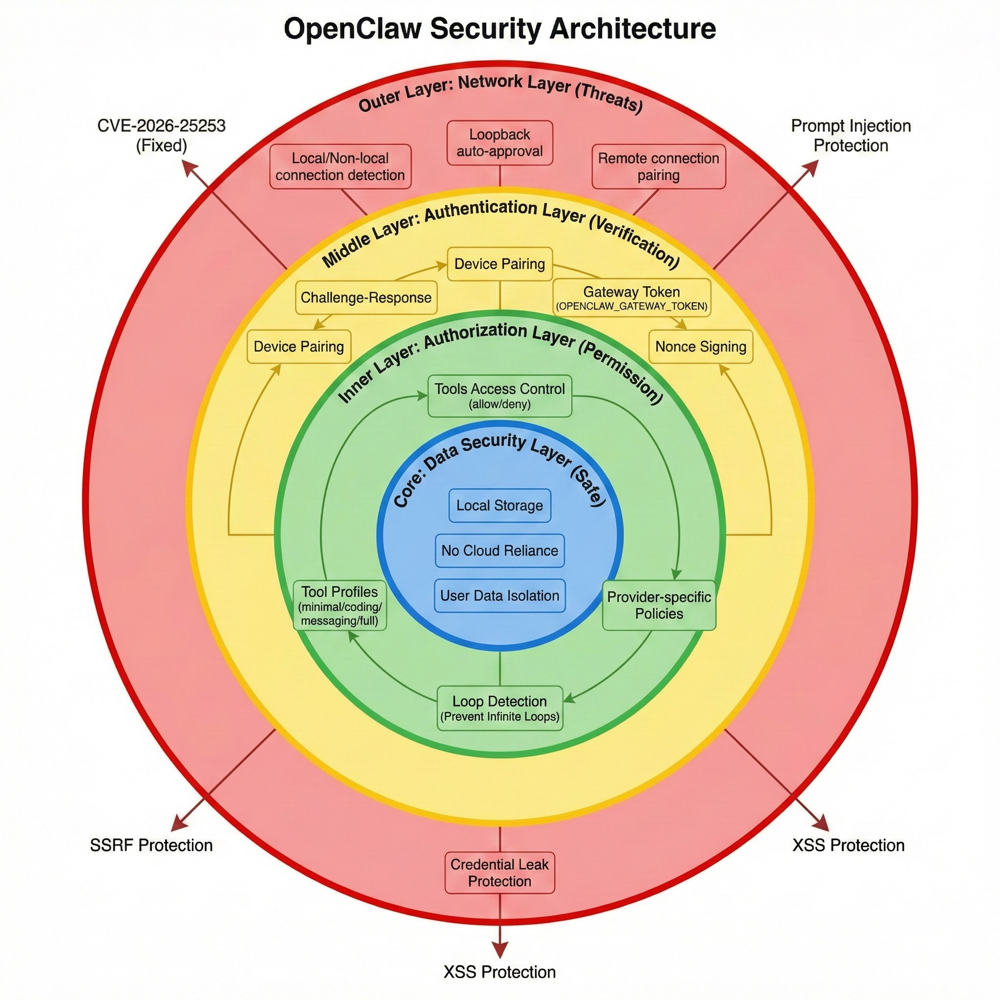

# OpenClaw 安全配置最佳实践

**适用版本**: v2026.2.3+
**来源**: 官方文档 | 社区实践
**验证状态**: Verified
**最后更新**: 2026-02-25

## 概述

OpenClaw 作为自托管 AI 网关，处理敏感的 AI API Key 和消息数据。本文档提供生产环境的安全配置指南，基于官方文档和社区最佳实践整理。

**⚠️ 安全声明**：本文档仅提供防御性安全配置指南，不涉及任何攻击性技术。

---

## 安全架构概览



OpenClaw 的安全机制包括：
- **认证层**：Gateway Token、API Key 加密存储
- **传输层**：TLS/SSL 加密、证书验证
- **权限层**：Agent 隔离、资源限制
- **审计层**：操作日志、敏感数据脱敏

---

## 1. 认证与授权

### 1.1 Gateway Token 管理

**默认配置（不安全）**：
```yaml
gateway:
  require_auth: false  # ⚠️ 所有连接无需认证
```

**推荐配置**：
```yaml
gateway:
  require_auth: true
  gateway_token: ${OPENCLAW_GATEWAY_TOKEN}  # 从环境变量读取
  token_rotation:
    enabled: true
    interval_days: 90      # 每 90 天强制轮换
    notify_before_days: 7  # 提前 7 天通知
```

**生成强 Token**：
```bash
# 生成 256 位随机 Token
openssl rand -hex 32

# 或使用 OpenClaw 内置命令
openclaw gateway --generate-token

# 输出示例：
# a1b2c3d4e5f6789012345678901234567890abcd1234567890abcdef123456
```

**存储 Token（推荐方式）**：
```bash
# 1. 使用环境变量（优先）
export OPENCLAW_GATEWAY_TOKEN="your-token-here"
echo 'export OPENCLAW_GATEWAY_TOKEN="..."' >> ~/.bashrc

# 2. 使用系统密钥链（macOS）
security add-generic-password \
  -a "$USER" \
  -s "openclaw-gateway-token" \
  -w "your-token-here"

# 读取时：
TOKEN=$(security find-generic-password \
  -a "$USER" \
  -s "openclaw-gateway-token" \
  -w)

# 3. 使用加密配置文件
openclaw config encrypt ~/.openclaw/config.yaml
# 需要输入主密码，加密后的配置安全存储
```

### 1.2 Agent 权限隔离

**配置 Agent 独立工作空间**：
```yaml
agents:
  agent-1:
    workspace: ~/.openclaw/agents/agent-1
    permissions:
      read_only: false
      allowed_paths:
        - ~/projects/project-a       # 仅能访问指定目录
        - ~/documents/work
      denied_paths:
        - ~/.ssh                     # 禁止访问敏感目录
        - ~/.aws
        - ~/.openclaw/config.yaml
      network:
        allow_outbound: true
        allowed_domains:
          - api.anthropic.com        # 白名单模式
          - api.openai.com
        blocked_ips:
          - 192.168.1.0/24           # 禁止访问内网
```

**使用 Agent 角色**：
```yaml
roles:
  readonly-agent:
    permissions:
      file_write: false
      execute_commands: false
      network_access: false

  standard-agent:
    permissions:
      file_write: true
      execute_commands: true
      network_access: true
      max_file_size: 10485760       # 10MB

  admin-agent:
    permissions:
      file_write: true
      execute_commands: true
      network_access: true
      system_commands: true          # 可执行系统命令

agents:
  code-reviewer:
    role: readonly-agent
  coding-assistant:
    role: standard-agent
  devops-agent:
    role: admin-agent
```

### 1.3 API Key 安全存储

**❌ 不安全的做法**：
```yaml
providers:
  anthropic:
    api_key: "sk-ant-api03-..."  # 明文存储，高风险
```

**✅ 推荐做法**：

**方案 A：环境变量**
```yaml
providers:
  anthropic:
    api_key: ${ANTHROPIC_API_KEY}
  openai:
    api_key: ${OPENAI_API_KEY}
```

```bash
# .env 文件（不要提交到 Git！）
ANTHROPIC_API_KEY=sk-ant-api03-...
OPENAI_API_KEY=sk-proj-...

# 加载环境变量
source ~/.openclaw/.env
```

**方案 B：加密 Vault**
```bash
# 初始化 Vault
openclaw vault init
# 输入主密码（务必牢记！）

# 存储 API Key
openclaw vault set anthropic_api_key "sk-ant-api03-..."
openclaw vault set openai_api_key "sk-proj-..."

# 配置文件引用
providers:
  anthropic:
    api_key: vault://anthropic_api_key
  openai:
    api_key: vault://openai_api_key
```

**方案 C：外部密钥管理（企业级）**
```yaml
providers:
  anthropic:
    api_key: aws-secrets://prod/openclaw/anthropic-key
    # 或
    api_key: gcp-secrets://projects/my-project/secrets/anthropic-key
    # 或
    api_key: azure-keyvault://my-vault/anthropic-key
```

---

## 2. 传输层安全

### 2.1 启用 TLS/SSL

**本地开发（可选 TLS）**：
```yaml
gateway:
  host: 127.0.0.1
  port: 18789
  tls: false
```

**生产环境（必须 TLS）**：
```yaml
gateway:
  host: 0.0.0.0          # 监听所有接口
  port: 18789
  tls:
    enabled: true
    cert_file: /etc/openclaw/certs/gateway.crt
    key_file: /etc/openclaw/certs/gateway.key
    client_auth: optional  # 或 required（双向认证）
    min_tls_version: "1.3"
    cipher_suites:
      - TLS_AES_256_GCM_SHA384
      - TLS_AES_128_GCM_SHA256
```

### 2.2 证书管理

**使用 Let's Encrypt（推荐）**：
```bash
# 安装 certbot
sudo apt install certbot

# 申请证书
sudo certbot certonly --standalone \
  -d gateway.yourdomain.com \
  --email your-email@example.com \
  --agree-tos

# 配置自动续期
sudo crontab -e
# 添加：
0 3 * * * certbot renew --quiet --deploy-hook "systemctl reload openclaw"
```

**证书权限设置**：
```bash
sudo chown openclaw:openclaw /etc/letsencrypt/live/gateway.yourdomain.com/*.pem
sudo chmod 600 /etc/letsencrypt/live/gateway.yourdomain.com/privkey.pem
```

### 2.3 客户端证书验证（双向 TLS）

**服务器配置**：
```yaml
gateway:
  tls:
    enabled: true
    client_auth: required
    ca_file: /etc/openclaw/certs/ca.crt  # 客户端 CA 证书
```

**生成客户端证书**：
```bash
# 1. 生成客户端私钥
openssl genrsa -out client.key 4096

# 2. 生成证书签名请求
openssl req -new -key client.key -out client.csr \
  -subj "/CN=client-1/O=MyOrg/OU=Engineering"

# 3. 使用 CA 签名
openssl x509 -req -days 365 -in client.csr \
  -CA ca.crt -CAkey ca.key -CAcreateserial \
  -out client.crt

# 4. 分发给客户端
scp client.{crt,key} user@client-machine:~/.openclaw/certs/
```

**客户端配置**：
```yaml
client:
  gateway_url: wss://gateway.yourdomain.com:18789
  tls:
    cert_file: ~/.openclaw/certs/client.crt
    key_file: ~/.openclaw/certs/client.key
    ca_file: ~/.openclaw/certs/ca.crt
    verify_server: true
```

---

## 3. 网络安全

### 3.1 防火墙配置

**仅允许本地访问（默认）**：
```bash
# iptables
sudo iptables -A INPUT -i lo -p tcp --dport 18789 -j ACCEPT
sudo iptables -A INPUT -p tcp --dport 18789 -j DROP

# firewalld
sudo firewall-cmd --permanent --add-rich-rule='
  rule family="ipv4" source address="127.0.0.1" port port="18789" protocol="tcp" accept'
sudo firewall-cmd --reload
```

**允许特定 IP 访问**：
```bash
# iptables
sudo iptables -A INPUT -s 192.168.1.100 -p tcp --dport 18789 -j ACCEPT
sudo iptables -A INPUT -s 10.0.0.0/8 -p tcp --dport 18789 -j ACCEPT
sudo iptables -A INPUT -p tcp --dport 18789 -j DROP

# firewalld
sudo firewall-cmd --permanent --add-rich-rule='
  rule family="ipv4" source address="192.168.1.100" port port="18789" protocol="tcp" accept'
```

### 3.2 反向代理（推荐）

**使用 Nginx**：
```nginx
# /etc/nginx/sites-available/openclaw
upstream openclaw_gateway {
    server 127.0.0.1:18789;
}

server {
    listen 443 ssl http2;
    server_name gateway.yourdomain.com;

    ssl_certificate /etc/letsencrypt/live/gateway.yourdomain.com/fullchain.pem;
    ssl_certificate_key /etc/letsencrypt/live/gateway.yourdomain.com/privkey.pem;
    ssl_protocols TLSv1.3 TLSv1.2;
    ssl_ciphers HIGH:!aNULL:!MD5;

    # WebSocket 支持
    location / {
        proxy_pass http://openclaw_gateway;
        proxy_http_version 1.1;
        proxy_set_header Upgrade $http_upgrade;
        proxy_set_header Connection "upgrade";
        proxy_set_header Host $host;
        proxy_set_header X-Real-IP $remote_addr;
        proxy_set_header X-Forwarded-For $proxy_add_x_forwarded_for;
        proxy_set_header X-Forwarded-Proto $scheme;

        # 超时设置
        proxy_connect_timeout 60s;
        proxy_send_timeout 60s;
        proxy_read_timeout 300s;

        # 限流
        limit_req zone=openclaw_limit burst=10 nodelay;
    }

    # 健康检查端点（可选）
    location /health {
        proxy_pass http://openclaw_gateway/health;
        access_log off;
    }
}

# 限流配置
http {
    limit_req_zone $binary_remote_addr zone=openclaw_limit:10m rate=10r/s;
}
```

**启用配置**：
```bash
sudo ln -s /etc/nginx/sites-available/openclaw /etc/nginx/sites-enabled/
sudo nginx -t
sudo systemctl reload nginx
```

### 3.3 DDoS 防护

**连接限制**：
```yaml
gateway:
  rate_limiting:
    enabled: true
    max_connections_per_ip: 10
    max_requests_per_minute: 100
    ban_threshold: 1000         # 超过此值封禁 IP
    ban_duration: 3600          # 封禁时长（秒）
```

**使用 fail2ban**：
```bash
# /etc/fail2ban/filter.d/openclaw.conf
[Definition]
failregex = ^<HOST> .* "WebSocket connection from <HOST>" .* 401
            ^<HOST> .* "Rate limit exceeded for <HOST>"
ignoreregex =

# /etc/fail2ban/jail.d/openclaw.conf
[openclaw]
enabled = true
port = 18789
filter = openclaw
logpath = /var/log/openclaw/gateway.log
maxretry = 5
bantime = 3600
findtime = 600
```

---

## 4. 数据安全

### 4.1 敏感数据脱敏

**配置日志脱敏**：
```yaml
logging:
  level: info
  format: json
  redact_patterns:
    - "api[_-]?key"
    - "token"
    - "password"
    - "secret"
    - "sk-[a-zA-Z0-9-]+"     # API Key 格式
    - "Bearer [a-zA-Z0-9-]+" # JWT Token
  redact_replacement: "[REDACTED]"
```

**日志示例**：
```json
// 脱敏前
{"level":"info","msg":"Anthropic API Key: sk-ant-api03-xxx"}

// 脱敏后
{"level":"info","msg":"Anthropic API Key: [REDACTED]"}
```

### 4.2 消息加密

**启用端到端加密**：
```yaml
gateway:
  encryption:
    enabled: true
    algorithm: AES-256-GCM
    key_derivation: PBKDF2
    key_rotation: true
    rotation_interval_days: 30
```

**客户端配置**：
```yaml
client:
  encryption:
    enabled: true
    public_key_path: ~/.openclaw/keys/gateway-public.pem
    private_key_path: ~/.openclaw/keys/client-private.pem
```

### 4.3 数据保留策略

**配置自动清理**：
```yaml
data_retention:
  messages:
    enabled: true
    retention_days: 30        # 消息保留 30 天
    archive_before_delete: true
    archive_path: ~/.openclaw/archives

  logs:
    enabled: true
    retention_days: 90
    compress_after_days: 7    # 7 天后压缩

  sessions:
    enabled: true
    retention_days: 7
    cleanup_interval: 86400   # 每天清理一次
```

**手动清理**：
```bash
# 清理 30 天前的消息
openclaw data clean --type messages --before 30d

# 清理所有归档
openclaw data clean --type archives --all
```

---

## 5. 审计与监控

### 5.1 审计日志

**启用审计**：
```yaml
audit:
  enabled: true
  log_path: ~/.openclaw/logs/audit.log
  log_format: json
  events:
    - authentication      # 认证事件
    - authorization      # 授权事件
    - config_change      # 配置变更
    - agent_create       # Agent 创建
    - agent_delete       # Agent 删除
    - file_access        # 文件访问
    - command_execution  # 命令执行
    - api_call           # API 调用
```

**审计日志示例**：
```json
{
  "timestamp": "2026-02-25T10:30:00Z",
  "event_type": "authentication",
  "user": "client-1",
  "ip": "192.168.1.100",
  "result": "success",
  "details": {
    "method": "token",
    "gateway": "gateway-prod"
  }
}

{
  "timestamp": "2026-02-25T10:31:00Z",
  "event_type": "file_access",
  "user": "agent-1",
  "action": "write",
  "path": "/home/user/project/file.py",
  "result": "allowed",
  "reason": "within allowed_paths"
}
```

### 5.2 异常检测

**配置告警规则**：
```yaml
monitoring:
  alerts:
    - name: "Failed Authentication"
      condition: "authentication_failed > 5 in 5m"
      severity: high
      notification:
        - email: security@example.com
        - slack: "#security-alerts"

    - name: "Unauthorized File Access"
      condition: "file_access_denied > 10 in 10m"
      severity: medium
      notification:
        - email: ops@example.com

    - name: "API Key Exposed"
      condition: "log_contains('sk-ant-api') OR log_contains('sk-proj-')"
      severity: critical
      notification:
        - email: security@example.com
        - pagerduty: "P1234567"
```

### 5.3 性能监控

**集成 Prometheus**：
```yaml
monitoring:
  prometheus:
    enabled: true
    port: 9090
    metrics:
      - gateway_connections_total
      - gateway_messages_total
      - gateway_errors_total
      - gateway_latency_seconds
      - agent_requests_total
      - agent_errors_total
```

**Grafana 仪表盘配置**：
```bash
# 导入预定义仪表盘
curl -o openclaw-dashboard.json \
  https://raw.githubusercontent.com/openclaw/openclaw/main/monitoring/grafana-dashboard.json

# 在 Grafana 中导入
```

---

## 6. 应急响应

### 6.1 安全事件响应流程

**疑似 API Key 泄露**：
```bash
# 1. 立即轮换 API Key
openclaw vault rotate-key anthropic_api_key

# 2. 撤销旧 Key（在 Provider 控制台）

# 3. 检查审计日志
openclaw audit search --event api_call --since 24h

# 4. 通知团队
openclaw alert send --severity critical \
  --message "Anthropic API Key rotated due to suspected leak"
```

**检测到未授权访问**：
```bash
# 1. 立即阻止 IP
openclaw gateway ban-ip 192.168.1.100

# 2. 轮换 Gateway Token
openclaw gateway rotate-token

# 3. 分析审计日志
openclaw audit export --since 7d --output security-review.json

# 4. 审查所有客户端
openclaw client list --show-last-auth
```

### 6.2 备份与恢复

**配置自动备份**：
```yaml
backup:
  enabled: true
  schedule: "0 2 * * *"     # 每天凌晨 2 点
  retention_days: 30
  encryption: true
  destinations:
    - type: local
      path: ~/.openclaw/backups
    - type: s3
      bucket: my-openclaw-backups
      region: us-west-2
      encryption: AES256
```

**手动备份**：
```bash
# 完整备份
openclaw backup create --full

# 仅配置
openclaw backup create --config-only

# 导出加密备份
openclaw backup create --encrypt --password-file ~/.openclaw/.backup-password
```

**恢复**：
```bash
# 列出备份
openclaw backup list

# 恢复特定备份
openclaw backup restore --id backup-20260225-020000

# 恢复到新位置
openclaw backup restore --id backup-20260225-020000 \
  --target-dir /tmp/openclaw-recovery
```

---

## 7. 合规性检查

### 7.1 安全自检清单

```bash
# 运行安全审计
openclaw security audit

# 输出示例：
✅ Gateway authentication: Enabled
✅ TLS/SSL: Enabled (TLS 1.3)
✅ API keys encryption: Enabled
⚠️  Client certificate auth: Disabled (recommended for production)
⚠️  Rate limiting: Disabled
❌ Audit logging: Disabled (required for compliance)
✅ Data retention policy: Configured
✅ Backup: Enabled and tested

Score: 75/100
```

### 7.2 定期检查脚本

创建 `~/.openclaw/scripts/security-check.sh`：
```bash
#!/bin/bash
set -e

echo "🔒 OpenClaw Security Check - $(date)"
echo "========================================"

# 检查配置权限
echo "1. 检查配置文件权限..."
CONFIG_PERMS=$(stat -f %A ~/.openclaw/config.yaml)
if [ "$CONFIG_PERMS" -gt "600" ]; then
    echo "❌ 配置文件权限过松：$CONFIG_PERMS（应为 600）"
else
    echo "✅ 配置文件权限正确"
fi

# 检查证书有效期
echo "2. 检查 TLS 证书..."
CERT_FILE=~/.openclaw/certs/gateway.crt
if [ -f "$CERT_FILE" ]; then
    EXPIRY=$(openssl x509 -in "$CERT_FILE" -noout -enddate | cut -d= -f2)
    EXPIRY_EPOCH=$(date -j -f "%b %d %H:%M:%S %Y %Z" "$EXPIRY" "+%s")
    NOW_EPOCH=$(date "+%s")
    DAYS_LEFT=$(( ($EXPIRY_EPOCH - $NOW_EPOCH) / 86400 ))

    if [ $DAYS_LEFT -lt 30 ]; then
        echo "⚠️  证书将在 $DAYS_LEFT 天后过期！"
    else
        echo "✅ 证书有效（剩余 $DAYS_LEFT 天）"
    fi
else
    echo "⚠️  未找到 TLS 证书"
fi

# 检查 API Key 是否明文存储
echo "3. 检查 API Key 存储..."
if grep -q "api_key: sk-" ~/.openclaw/config.yaml; then
    echo "❌ 发现明文 API Key！请使用环境变量或 Vault"
else
    echo "✅ API Key 未明文存储"
fi

# 检查审计日志
echo "4. 检查审计日志..."
if [ -f ~/.openclaw/logs/audit.log ]; then
    LOG_SIZE=$(du -h ~/.openclaw/logs/audit.log | cut -f1)
    echo "✅ 审计日志存在（大小：$LOG_SIZE）"
else
    echo "⚠️  审计日志未启用"
fi

echo "========================================"
echo "检查完成！"
```

**设置定期检查**：
```bash
chmod +x ~/.openclaw/scripts/security-check.sh

# 添加到 crontab（每周一早上 8 点）
crontab -e
# 添加：
0 8 * * 1 ~/.openclaw/scripts/security-check.sh | mail -s "OpenClaw Security Check" ops@example.com
```

---

## 8. 最佳实践总结

### 生产环境部署检查清单

**必须项（P0）**：
- [ ] 启用 Gateway 认证（`require_auth: true`）
- [ ] 使用强 Token（256 位随机字符串）
- [ ] API Key 加密存储（环境变量或 Vault）
- [ ] 启用 TLS/SSL（`tls.enabled: true`）
- [ ] 配置防火墙规则（最小权限原则）
- [ ] 启用审计日志（`audit.enabled: true`）
- [ ] 配置自动备份（`backup.enabled: true`）
- [ ] 设置数据保留策略

**推荐项（P1）**：
- [ ] 使用 Let's Encrypt 证书
- [ ] 配置客户端证书验证（双向 TLS）
- [ ] 启用限流（`rate_limiting.enabled: true`）
- [ ] 配置 Agent 权限隔离
- [ ] 集成监控告警（Prometheus + Grafana）
- [ ] 配置日志脱敏规则
- [ ] 使用反向代理（Nginx/Traefik）

**可选项（P2）**：
- [ ] 启用端到端加密
- [ ] 集成 SIEM 系统
- [ ] 配置 DDoS 防护（fail2ban）
- [ ] 使用外部密钥管理（AWS Secrets Manager）
- [ ] 实施 SOC 2 合规性检查

---

## 参考架构图


---

## 相关文档

- [快速部署指南](../getting-started/20260225-quick-deploy-guide.md)
- [WebSocket 故障排查](../troubleshooting/20260225-websocket-troubleshooting.md)
- [版本演进总结](../changelog/20260225-version-evolution.md)

---

## 参考资源

- 📖 官方安全文档：https://docs.openclaw.ai/security
- 🔒 OWASP Top 10：https://owasp.org/www-project-top-ten/
- 🛡️ CIS Benchmarks：https://www.cisecurity.org/cis-benchmarks
- 💬 Discord #security 频道：https://discord.gg/clawd
