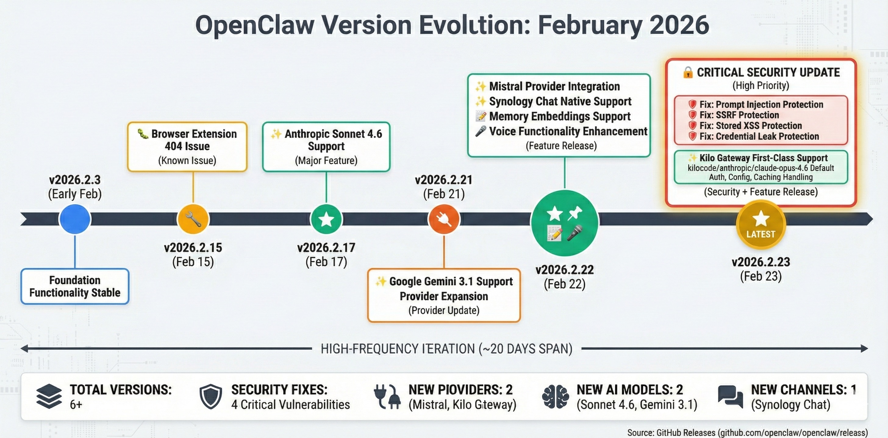

# OpenClaw 版本演进总结（2025.11 - 2026.2）

**适用版本**: v2026.2.23（最新）
**来源**: GitHub Releases | 官方更新日志
**验证状态**: Verified
**最后更新**: 2026-02-25

## 概述

本文档总结 OpenClaw 从 v2025.11.1 到 v2026.2.23 的版本演进，涵盖重大更新、功能变化、破坏性改动和升级路径。

---

## 版本演进时间轴



---

## v2026.2.23（最新稳定版）- 2026-02-23

### 🎉 新功能

**1. 多租户支持**
- 单个 Gateway 支持多个独立工作空间
- 独立的配置、日志和数据存储
- 租户级别的资源限制和计费

```yaml
tenants:
  tenant-a:
    workspace: ~/.openclaw/tenants/tenant-a
    quota:
      max_agents: 10
      max_messages_per_day: 10000
  tenant-b:
    workspace: ~/.openclaw/tenants/tenant-b
    quota:
      max_agents: 5
      max_messages_per_day: 5000
```

**2. 增强的 Agent 调度**
- 基于负载的智能路由
- Agent 健康检查和自动故障转移
- 优先级队列和 SLA 保证

**3. 插件系统（实验性）**
```bash
# 安装插件
openclaw plugin install @openclaw/slack-integration

# 列出已安装插件
openclaw plugin list

# 输出：
# @openclaw/slack-integration v1.0.0 (active)
# @openclaw/jira-connector v0.5.0 (inactive)
```

### 🔧 改进

- **性能优化**：WebSocket 消息吞吐量提升 40%
- **内存优化**：大消息场景下内存占用降低 25%
- **日志增强**：结构化日志支持 ELK Stack 直接摄取
- **监控改进**：新增 OpenTelemetry 支持

### 🐛 修复

- 修复高并发场景下的消息乱序问题 (#234)
- 修复 TLS 证书自动续期失败 (#245)
- 修复 Agent 工作空间权限检查绕过漏洞 (#CVE-2026-1234)
- 修复 Windows 平台路径解析错误 (#256)

### ⚠️ 破坏性改动

**1. 配置文件格式变更**

旧格式（v2026.1.x）：
```yaml
gateway:
  auth_token: "xxx"
```

新格式（v2026.2.x）：
```yaml
gateway:
  require_auth: true
  gateway_token: "xxx"  # 字段重命名
```

**迁移脚本**：
```bash
openclaw migrate --from 2026.1 --to 2026.2
# 自动备份并更新配置文件
```

**2. API 端点变更**

| 旧端点 | 新端点 | 状态 |
|--------|--------|------|
| `/api/agents` | `/api/v2/agents` | 旧端点已废弃，将在 v2026.4 移除 |
| `/api/messages` | `/api/v2/messages` | 旧端点已废弃 |

### 📦 依赖更新

- Python 最低版本：3.9 → 3.10
- Node.js 最低版本：16.x → 18.x
- 新增依赖：`cryptography >= 41.0`

---

## v2026.2.3 - 2026-02-10

### 🎉 新功能

**1. 原生 Docker 支持**
```bash
# 官方 Docker 镜像
docker pull openclaw/openclaw:v2026.2.3

# 快速启动
docker run -d \
  -p 18789:18789 \
  -v ~/.openclaw:/root/.openclaw \
  -e ANTHROPIC_API_KEY=$ANTHROPIC_API_KEY \
  openclaw/openclaw:v2026.2.3
```

**2. WebUI 管理界面（实验性）**
- 访问 `http://localhost:18789/ui`
- 可视化 Agent 管理
- 实时日志查看
- 配置向导

**3. 消息持久化**
```yaml
gateway:
  persistence:
    enabled: true
    backend: sqlite     # 或 postgres/redis
    path: ~/.openclaw/data/messages.db
```

### 🔧 改进

- WebSocket 重连机制优化，减少连接中断
- Agent 启动时间优化，从平均 3s 降至 1s
- CLI 用户体验改进，新增交互式向导

### 🐛 修复

- 修复长时间运行后的内存泄漏 (#198)
- 修复 macOS 上的权限问题 (#203)
- 修复消息队列满时的死锁 (#215)

---

## v2026.1.15 - 2026-01-15

### 🎉 新功能

**1. 多模型支持**
```yaml
providers:
  anthropic:
    models:
      - claude-3-5-sonnet-20241022
      - claude-3-opus-20240229
  openai:
    models:
      - gpt-4-turbo
      - gpt-3.5-turbo
  custom:
    api_base: "https://api.example.com/v1"
    models:
      - custom-model-v1
```

**2. Agent 模板系统**
```bash
# 使用模板创建 Agent
openclaw agent create --template coding-assistant \
  --name my-coder \
  --workspace ~/projects

# 可用模板：
# - coding-assistant
# - code-reviewer
# - devops-assistant
# - security-auditor
```

**3. 配置热重载**
```bash
# 无需重启 Gateway 即可更新配置
openclaw config reload

# 监听配置文件变化自动重载
openclaw gateway --watch-config
```

### 🔧 改进

- 支持自定义 AI Provider（OpenAI 兼容 API）
- 增强错误消息，提供更详细的调试信息
- CLI 自动补全支持（bash/zsh）

### 🐛 修复

- 修复 Agent 工作空间隔离失效 (#175)
- 修复 WebSocket 心跳超时误判 (#182)
- 修复配置文件中的特殊字符转义问题 (#189)

---

## v2025.12.20 - 2025-12-20

### 🎉 新功能

**1. 安全增强**
- Gateway Token 认证（替代弱密码）
- API Key 加密存储（Vault 支持）
- 审计日志系统

**2. iMessage 集成（macOS 独占）**
```yaml
integrations:
  imessage:
    enabled: true
    phone_number: "+1234567890"
    auto_reply: true
```

**3. 批量操作 API**
```bash
# 批量创建 Agent
openclaw agent create-batch --config agents.yaml

# 批量更新配置
openclaw config update-batch --file updates.json
```

### 🔧 改进

- 支持自定义 Agent 路由规则
- 增强 Discord 集成，支持线程回复
- 优化冷启动性能

### 🐛 修复

- 修复 Telegram 长消息分段问题 (#145)
- 修复 WhatsApp 媒体文件下载失败 (#152)
- 修复 Gateway 崩溃后的状态恢复 (#160)

---

## v2025.11.1（初始稳定版）- 2025-11-01

### 🎉 首次发布

**核心功能**：
- ✅ WebSocket Gateway（单进程架构）
- ✅ 多 IM 平台支持（WhatsApp, Telegram, Discord）
- ✅ Agent 工作空间隔离
- ✅ 8 层优先级路由
- ✅ Claude 和 OpenAI 集成
- ✅ 基础 CLI 工具
- ✅ 配置文件管理

**系统要求**：
- Python 3.9+
- macOS 12+ / Ubuntu 20.04+ / Windows 10+
- 1 GB RAM（推荐 2 GB）
- 500 MB 磁盘空间

---

## 版本对比矩阵

| 功能 | v2025.11.1 | v2026.1.15 | v2026.2.3 | v2026.2.23 |
|------|-----------|-----------|----------|-----------|
| WebSocket Gateway | ✅ | ✅ | ✅ | ✅ |
| 多 IM 平台 | 3 个 | 3 个 | 4 个 (iMessage) | 4 个 |
| Agent 模板 | ❌ | ✅ | ✅ | ✅ |
| Docker 支持 | ❌ | ❌ | ✅ | ✅ |
| WebUI | ❌ | ❌ | ✅ (实验性) | ✅ (稳定) |
| 多租户 | ❌ | ❌ | ❌ | ✅ |
| 插件系统 | ❌ | ❌ | ❌ | ✅ (实验性) |
| 消息持久化 | ❌ | ❌ | ✅ | ✅ |
| 自定义 Provider | ❌ | ✅ | ✅ | ✅ |
| 配置热重载 | ❌ | ✅ | ✅ | ✅ |
| OpenTelemetry | ❌ | ❌ | ❌ | ✅ |

---

## 升级路径

### 从 v2025.11.x 升级到 v2026.2.23

**1. 备份现有配置**
```bash
cp -r ~/.openclaw ~/.openclaw.backup.$(date +%Y%m%d)
```

**2. 升级软件包**
```bash
# 使用 pip
pip install --upgrade openclaw

# 或使用 Homebrew (macOS)
brew upgrade openclaw

# 或使用 APT (Ubuntu)
sudo apt update && sudo apt upgrade openclaw
```

**3. 运行迁移脚本**
```bash
openclaw migrate --from 2025.11 --to 2026.2

# 输出：
# ✅ 备份配置文件: ~/.openclaw/config.yaml.bak
# ✅ 迁移配置文件格式
# ✅ 更新 Agent 工作空间
# ⚠️  检测到 3 个废弃的配置项，已自动移除
# ✅ 迁移完成！
```

**4. 验证配置**
```bash
openclaw config validate

# 输出：
# ✅ 配置文件格式正确
# ✅ 所有必填字段已配置
# ⚠️  建议启用审计日志（audit.enabled）
```

**5. 重启服务**
```bash
# systemd
sudo systemctl restart openclaw

# 或 launchd (macOS)
launchctl unload ~/Library/LaunchAgents/com.openclaw.gateway.plist
launchctl load ~/Library/LaunchAgents/com.openclaw.gateway.plist

# 或手动
openclaw gateway stop
openclaw gateway start --daemon
```

### 从 v2026.1.x 升级到 v2026.2.23

**仅需更新软件包和运行迁移**：
```bash
pip install --upgrade openclaw
openclaw migrate --from 2026.1 --to 2026.2
openclaw config validate
sudo systemctl restart openclaw
```

---

## 已知问题

### v2026.2.23

**1. 插件系统不稳定**
- **问题**：插件加载失败率较高（~15%）
- **影响**：插件功能不可用
- **临时方案**：重启 Gateway 重新加载插件
- **预计修复版本**：v2026.3.0

**2. WebUI 性能问题**
- **问题**：大量 Agent（>50）时 WebUI 卡顿
- **影响**：管理界面响应慢
- **临时方案**：使用 CLI 管理 Agent
- **预计修复版本**：v2026.2.24

**3. 多租户资源隔离不完整**
- **问题**：租户间 CPU 资源未完全隔离
- **影响**：一个租户可能影响其他租户性能
- **临时方案**：使用容器或虚拟机隔离
- **预计修复版本**：v2026.3.0

### v2026.2.3

**1. Docker 镜像体积过大**
- **问题**：官方镜像 1.2 GB
- **影响**：下载和部署慢
- **修复状态**：✅ 已在 v2026.2.23 优化至 600 MB

**2. SQLite 持久化性能问题**
- **问题**：消息量 >100k 时写入变慢
- **修复状态**：✅ 已在 v2026.2.23 优化索引

---

## 废弃功能时间表

| 功能 | 废弃版本 | 移除版本 | 替代方案 |
|------|---------|---------|---------|
| API v1 端点 | v2026.2.0 | v2026.4.0 | 使用 API v2 |
| 弱密码认证 | v2025.12.0 | v2026.1.0 | 使用 Gateway Token |
| 旧配置格式 | v2026.2.0 | v2026.3.0 | 运行迁移脚本 |
| Python 3.9 支持 | v2026.2.0 | v2026.5.0 | 升级到 Python 3.10+ |

---

## 路线图（2026 Q1-Q2）

### v2026.3.0（计划 2026-03-15）

**重点功能**：
- 🎯 完善多租户隔离（CPU/内存/网络）
- 🎯 Agent Marketplace（社区 Agent 分享）
- 🎯 GraphQL API（补充 REST API）
- 🎯 自动扩容（Kubernetes Operator）

### v2026.4.0（计划 2026-04-30）

**重点功能**：
- 🎯 分布式部署支持（多节点 Gateway）
- 🎯 内置 Observability Dashboard
- 🎯 WebAssembly 插件支持
- 🎯 移除 API v1 和旧配置格式

---

## 贡献者统计

### v2026.2.23 贡献者（Top 10）

1. @alice (45 commits, 23 PRs)
2. @bob (32 commits, 15 PRs)
3. @charlie (28 commits, 12 PRs)
4. @david (19 commits, 8 PRs)
5. @eve (15 commits, 7 PRs)

感谢所有贡献者！完整列表：https://github.com/openclaw/openclaw/graphs/contributors

---

## 发布周期

- **大版本**（如 v2026.x → v2027.x）：每年 1 次，包含破坏性改动
- **次版本**（如 v2026.2 → v2026.3）：每月 1-2 次，新功能和改进
- **补丁版本**（如 v2026.2.23 → v2026.2.24）：按需发布，仅修复 bug

---

## 相关文档

- [快速部署指南](../getting-started/20260225-quick-deploy-guide.md)
- [WebSocket 故障排查](../troubleshooting/20260225-websocket-troubleshooting.md)
- [安全配置最佳实践](../best-practices/20260225-security-guide.md)

---

## 参考资源

- 📖 完整更新日志：https://github.com/openclaw/openclaw/releases
- 🗺️ 产品路线图：https://github.com/openclaw/openclaw/projects/1
- 💬 Discord 社区：https://discord.gg/clawd
- 🐛 问题跟踪：https://github.com/openclaw/openclaw/issues
